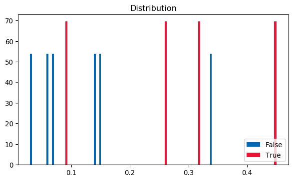
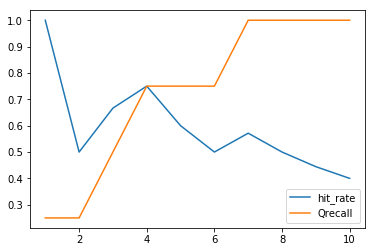
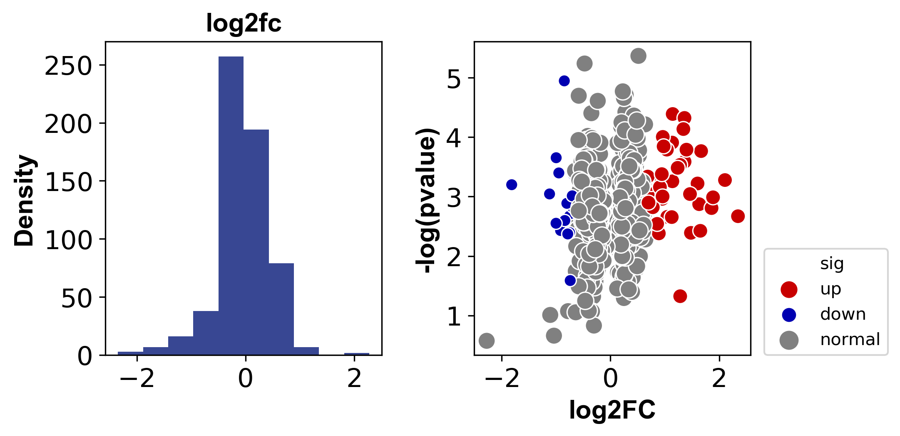
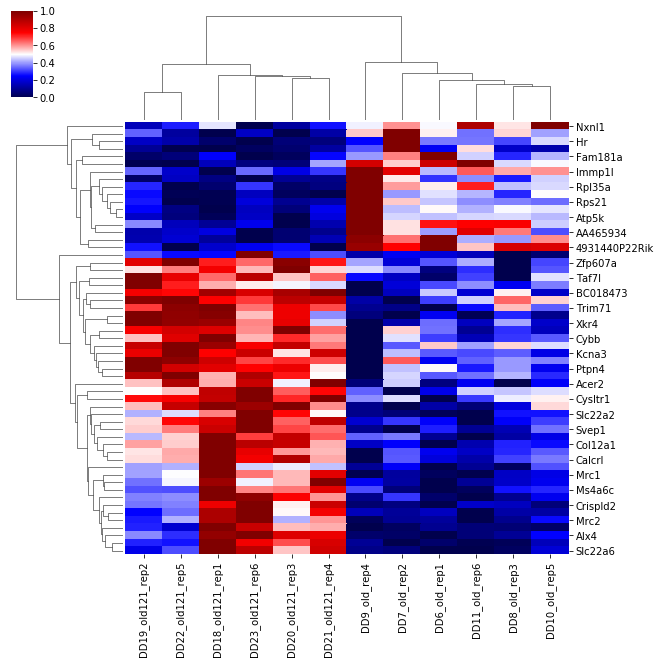
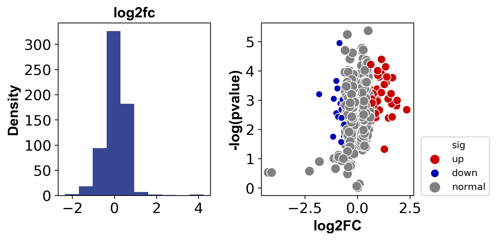
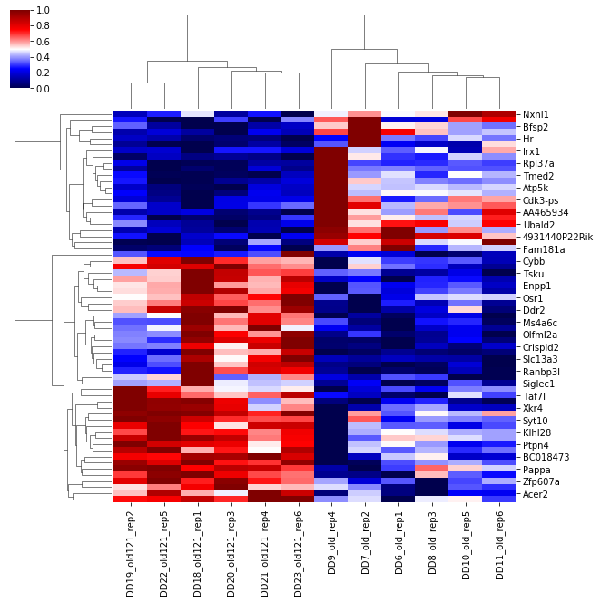

# **ClassifyGene: Python library for screening classification diagnostic gene**

[](https://www.tidyverse.org/lifecycle/#maturing)
[](https://img.shields.io/appveyor/build/gruntjs/grunt)
[](https://img.shields.io/apm/l/vim-mode)


## Where to get it

Binary installers for the latest released version are available at the pypi

    #PyPI
    #pip install ClassifyGene

## Dependencies

- Pyomic

See the full installation instructions for minimum supported versions of required, recommended and optional dependencies

## Function available

| Functions         | Description                                                  |
| ----------------- | ------------------------------------------------------------ |
| get_hit_rate      | Calculate the hit-rate of classifier                         |
| get_Qrecall       | Calculate the Qrecall of classifier                          |
| get_avg_hit_rate  | Calculate the average hit-rate of classifier                 |
| get_avg_Qrecall   | Calculate the average Qrecall and PEM of classifier          |
| cal_classgene     | Calculate the performance of each gene as a classifier       |
| find_classifygene | Find out genes that can be classified as diagnostic genes    |
| find_classifyDEG  | Find out the differential expression gene according to ROC/PEM and foldchange |

## Algorithm principle (ROC, hit-rate, Qrecall)

An example is given to compare the effect of the classifier

### Test data



### Example

#### Input

```python
import matplotlib.pyplot as plt
from sklearn import metrics
tmp_dict = {0.45:1,
            0.34:0,
            0.32:1,
            0.26:1,
            0.15:0,
            0.14:0,
            0.09:1,
            0.07:0,
            0.06:0,
            0.03:0
            }
total=10
hit_rate,avg_hit_rate = ClassifyGene.get_hit_rate(tmp_dict,6,4)
Qrecall,avg_Qrecall,PEM = ClassifyGene.get_Qrecall(tmp_dict,6,4)
fpr, tpr, thresholds=metrics.roc_curve(np.array(list(tmp_dict.values())),np.array(list(tmp_dict.keys())))
print()
print(avg_hit_rate,avg_Qrecall,PEM)
plt.plot(list(range(1,1+total)),hit_rate)
plt.plot(list(range(1,1+total)),Qrecall)

plt.legend(['hit_rate','Qrecall'])
plt.show()
roc_auc = metrics.auc(fpr, tpr)
#plt.subplot(grid[0,2:4])
plt.plot(fpr, tpr,'#EE1437')
plt.title('ROC curve (AUC = {1:0.2f})'
             ''.format(0, roc_auc))
plt.xlabel('Fpr')
plt.ylabel('Tpr')
```

#### Output




## Cal_classgene

Calculate the performance of each gene as a classifier

### Receiver operating characteristic curve (ROC)

#### Input

```python
class1=ClassifyGene.cal_classgene(data,eg,cg,method='ROC',threshold=0.99)
class1.head()
```

#### Output

|      |    gene |      auc | sig    |
| ---: | ------: | -------: | ------ |
|    0 | Fam175a | 0.416667 | normal |
|    1 |   1-Mar | 0.833333 | normal |
|    2 |   Mob3b | 0.722222 | normal |
|    3 |    Vapa | 0.583333 | normal |
|    4 |    Crat | 0.083333 | normal |

### Potential extract measure (PEM)

#### Input

```python
class2=ClassifyGene.cal_classgene(data,eg,cg,method='PEM',threshold=0.99)
class2.head()
```

#### Output

|      |    gene |      pem | sig    |
| ---: | ------: | -------: | ------ |
|    0 | Fam175a | -0.166667 | normal |
|    1 |   1-Mar | 0.666667 | normal |
|    2 |   Mob3b | 0.444444 | normal |
|    3 |    Vapa | 0.166667 | normal |
|    4 |    Crat | -0.833333 | normal |

## find_classifyDEG

Calculate the performance of each gene as a classifier

Adjusting the threshold can change the number of genes screened

### Receiver operating characteristic curve (ROC)

#### Input

```python
#ROC result
res1=ClassifyGene.find_classifyDEG(data,eg,cg,method='ROC',threshold=0.99,log2fc=-1)
```

#### Output

```
...Calculated the class value of each gene
...Calculated the differential expression gene by classification
up: 40
down: 17
```





### Potential extract measure (PEM)

#### Input

```python
#PEM result
res2=ClassifyGene.find_classifyDEG(data,eg,cg,method='PEM',threshold=0.99,log2fc=-1)
```

#### Output

```
...Calculated the class value of each gene
...Calculated the differential expression gene by classification
up: 41
down: 23
```



